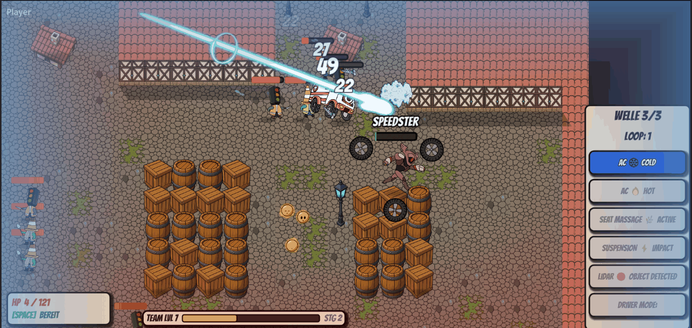
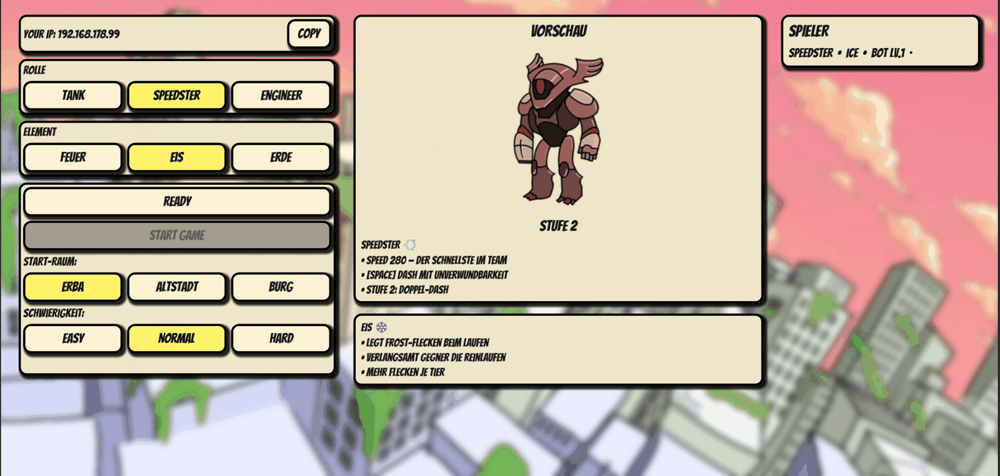
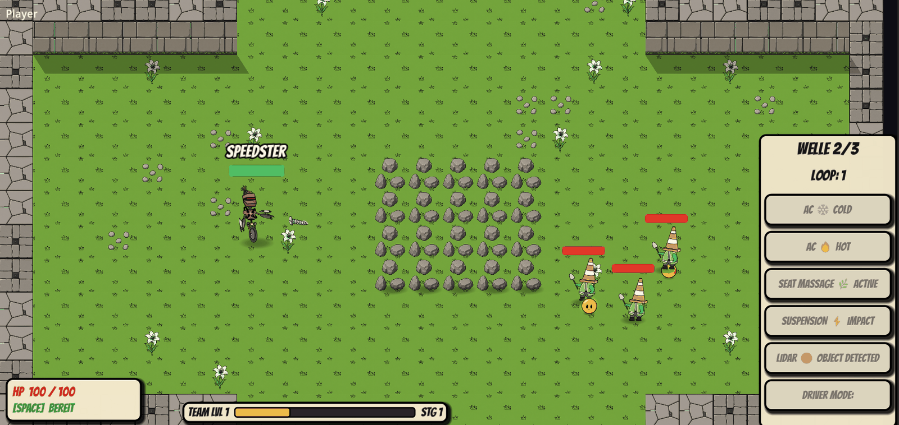
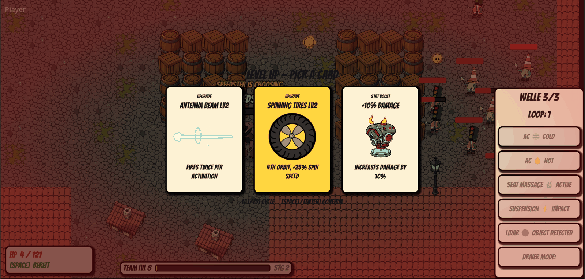
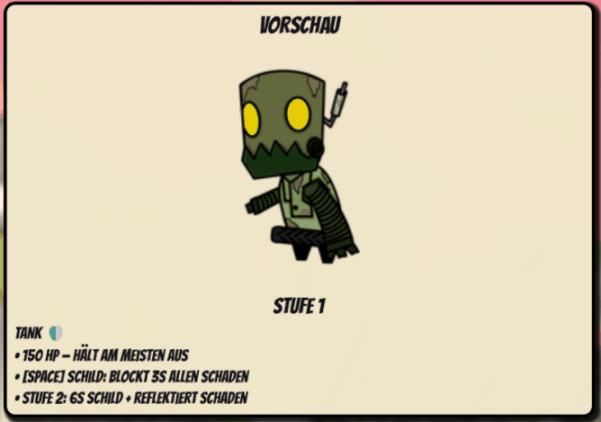
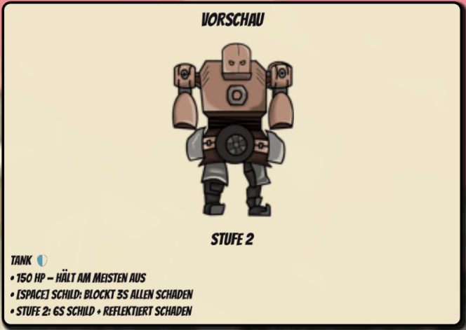
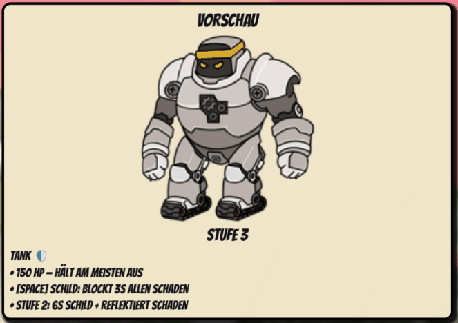

# AutoBonk

**A co-op in-car roguelike where the car is the feedback system.**

*Christian · Moritz · Okan · Jan — Designing Gamified Systems, University of Bamberg*

---

AutoBonk is a three-player cooperative top-down roguelike, built in Godot 4 for the CARIAD
design brief: entertain families on long car journeys in ten-to-fifteen-minute sessions, using
the vehicle's own sensors and actuators. Rather than treating the car as a screen that merely
hosts a game, we made **the car the game's feedback system.**



## Roles, elements and forced co-op

Each player permanently commits to one of three exclusive roles — **Tank, Speedster, Engineer** —
and to one of three elements: **Fire** burns on hit, **Ice** slows, **Earth** heals the team
passively. Because roles are exclusive, cooperation is structural rather than optional. A player
at zero HP goes down rather than dying, and a teammate revives them by holding `E` nearby, once
per arena. If all three go down at once, the run ends.



## Structure of a run

Play runs through three biomes abstracted from a real OpenStreetMap route through Bamberg: the
**ERBA island**, the **Altstadt**, and **Burg Altenburg**. Each is subdivided into five arenas of
three enemy waves, ending in a boss fight; defeating the boss begins the next loop, scaled harder.



## Two reinforcement loops

Second to second, kills drop XP orbs that magnetise into one shared team pool, with thresholds
scaling by party size, accompanied by roughly thirty-five juice effects.

Minute to minute, the team levels up together and every player simultaneously picks one of three
cards: a weapon unlock, a weapon upgrade, an element upgrade, or a stat boost. All five weapons
auto-aim, are earned exclusively through these cards, and only three can be active at once — so
builds get negotiated out loud.



Cars evolve across three stages — **Car → Proto-Bot → Full AutoBot** — each unlocking the role's
signature ability.

<p align="center">
  
  
  
</p>

## Vehicle integration

The vehicle integration is the selling point. A permanently visible CARIAD panel maps game events
onto real car outputs: Ice fires *AC COLD*, Fire *AC HOT*, Earth healing *SEAT MASSAGE*, heavy
damage *SUSPENSION IMPACT*, enemy spawns *LIDAR OBJECT DETECTED*. Every event broadcasts to all
screens, so one player's action lights up everybody's dashboard.

**Driver Mode** runs the other way, letting the car act on the game: once per arena the vehicle's
state shifts for a few seconds and hits all three players at once — ECO speeds them up, SPORT
halves their speed, REPAIR heals, OVERDRIVE boosts damage. Nobody picks it, so the team adapts
together.

## Technical notes

The game is host-authoritative over LAN, with a stateless event bus keeping the HUD synchronised
across peers and snapshot interpolation smoothing remote players at 20 Hz. It was playtested at
the Gamification EXPO in June 2026.

## Running the project

Requires **Godot 4**. Open the project folder in the Godot editor and press play, or:

```
godot --path .
```

One instance hosts, the others join over LAN via the host's IP (shown in the lobby).

## Controls

| Action | Key |
| --- | --- |
| Move | `WASD` |
| Role ability | `Space` |
| Revive teammate | hold `R` |
| Card selection | `A` / `D` to cycle, `Space` / `Enter` to confirm |
| Show stats overlay | hold `Tab` |
| Pause / menu | `Esc` |

Weapons auto-aim — there is no aiming input.

## Repository layout

```
assets/          art, audio and tilesets
autobonkassets/  character and weapon sprites
autoloads/       global singletons (event bus, game state, networking)
scenes/          all game scenes and scripts
docs/            asset briefs, tilemap references, screenshots
```
